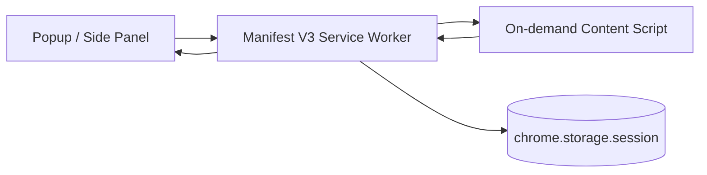

# Codex Browser Companion

Codex Browser Companion is a Chrome extension that turns the active tab into a structured, user-controlled workspace for Codex-style browser assistance.

It is designed to:

- detect the active tab URL, title, and page state
- extract visible page text and structured DOM context
- present safe, user-approved browser actions
- support step-by-step page workflows
- keep the browser-side control surface small, explicit, and auditable

## Architecture



### Runtime pieces

- `background/service-worker.ts` orchestrates state, approvals, tab tracking, badge updates, and message routing.
- `content/content-script.ts` inspects the DOM, captures page snapshots, observes navigation/mutations, and executes approved page actions.
- `ui/popup/*` provides the quick interaction surface.
- `ui/sidepanel/*` provides the persistent workspace.
- `shared/*` contains the typed message schema, DOM extraction utilities, action policy rules, and command parsing.

## Supported v1 Commands

The UI includes quick actions and a command box. Supported examples:

- `scan page`
- `list interactive elements`
- `summarize page`
- `suggest next actions`
- `click save`
- `type hello into search`
- `select Canada in country`
- `scroll down 600`
- `go back`
- `refresh`

Click, type, select, and submit actions always go through an approval queue first.

## Install

1. Install dependencies:

```bash
npm install
```

2. Build the extension:

```bash
npm run build
```

3. Open Chrome and go to `chrome://extensions`.

4. Turn on Developer mode.

5. Click Load unpacked and select the `dist/` folder from this workspace.

## Development Workflow

For iterative development:

```bash
npm run dev
```

That keeps rebuilding the extension bundle and copied assets. After each rebuild, reload the unpacked extension in Chrome.

Helpful extra commands:

```bash
npm run typecheck
npm test
```

## Build Output

The unpacked extension lives in `dist/` after `npm run build`.

Important output files:

- `dist/manifest.json`
- `dist/background.js`
- `dist/content.js`
- `dist/popup/index.html`
- `dist/popup/popup.js`
- `dist/popup/popup.css`
- `dist/sidepanel/index.html`
- `dist/sidepanel/panel.js`
- `dist/sidepanel/panel.css`

## Permissions

The extension requests only the permissions it needs:

- `activeTab` lets the extension work with the current tab after explicit user interaction.
- `scripting` allows on-demand injection of the content script.
- `storage` saves session state, approvals, and logs locally inside the extension.
- `tabs` reads the active tab URL/title and tracks navigation or activation changes.
- `sidePanel` enables the persistent side panel UI on supported Chrome versions.

There are no blanket host permissions. The extension stays focused on the active tab rather than silently broadening access across every site.

## Security Model

This extension is intentionally conservative.

- It never captures password values.
- It does not type into or submit sensitive fields such as login forms.
- It restricts actions to the active tab.
- It requires explicit approval for click, type, select, and submit actions.
- It does not send page data to a remote service.
- It does not auto-run arbitrary browser actions without a visible approval gate.
- It marks snapshots stale when the page changes so the user can rescan before approving actions.

If a page is not inspectable, the extension refuses to inject or act and surfaces the reason in the UI.

## Limitations

- `chrome://`, extension pages, and other browser-internal pages are not inspectable.
- Cross-origin iframe content is not deeply inspected.
- Password and file inputs are intentionally excluded from v1 automation.
- The command box only understands a safe subset of browser commands in v1.
- There is no local Codex runtime bridge yet; this build is the browser-side companion layer.

## Manual QA Checklist

Use these page types after loading the unpacked extension:

1. Standard content page
   - Open a normal article or product page.
   - Confirm the active tab title and URL show up.
   - Run `Scan page`.
   - Confirm headings, links, and interactive elements appear.

2. Form page
   - Open a form with text inputs and a select box.
   - Run `List interactive elements`.
   - Confirm the fields and controls are listed.
   - Try `type hello into ...` and verify an approval is required.

3. Dynamic SPA page
   - Open a single-page app or route-driven app.
   - Navigate inside the app and confirm the page state updates.
   - Rescan and confirm the snapshot refreshes after navigation.

4. Login page
   - Open a page with password inputs.
   - Confirm password fields are flagged as sensitive.
   - Verify the extension refuses to type into them.

5. Long article page
   - Open a long reading page with multiple headings.
   - Run `Summarize page`.
   - Confirm the visible text is capped and the outline is readable.

## Future Enhancements

- local Codex runtime bridge
- richer page understanding and semantic grouping
- workflow memory across steps
- multi-tab orchestration
- site-specific adapters
- safer action sandboxing

## Project Structure

See the source tree in the workspace for the full implementation. The main source folders are `src/background`, `src/content`, `src/shared`, `src/ui`, and `tests`.
