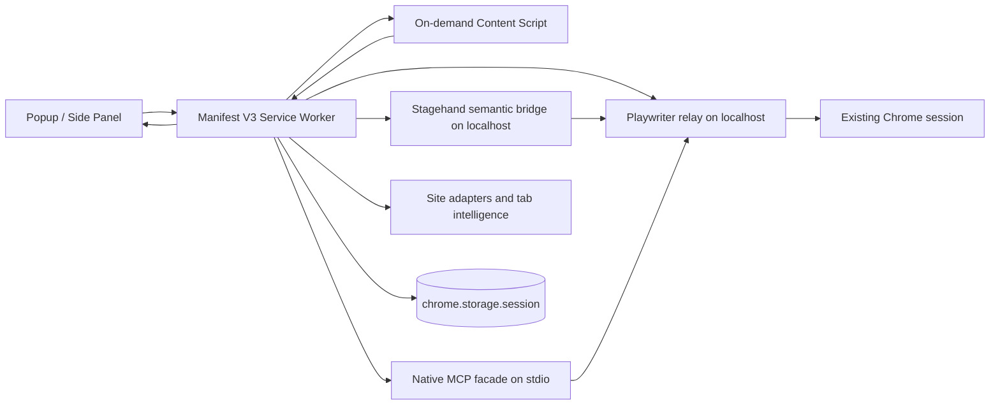

# Codex Browser Companion

Codex Browser Companion is a Chrome extension that turns the active tab into a structured, user-controlled workspace for Codex-style browser assistance.

It is designed to:

- detect the active tab URL, title, and page state
- extract visible page text and structured DOM context
- recognize common site-specific adapters for Google and LinkedIn workflows
- present safe, user-approved browser actions
- support step-by-step page workflows
- remember and resume multi-step workflows locally
- search and focus tracked tabs through an MCP-style tab intelligence layer
- keep the browser-side control surface small, explicit, and auditable

## Architecture



### Runtime pieces

- `background/service-worker.ts` orchestrates state, approvals, tab tracking, badge updates, and message routing.
- `content/content-script.ts` inspects the DOM, captures page snapshots, observes navigation/mutations, and executes approved page actions.
- `Playwriter` provides the live Chrome bridge on `localhost:19988`; CBC polls it for bridge health and session attachment.
- `Stagehand` provides the optional semantic bridge on `localhost:19989`; CBC uses it to derive higher-quality next-action suggestions when the bridge is enabled.
- `native/tab-mcp.ts` provides an optional local MCP facade that speaks the same `TabContext` contract to external Codex clients.
- `shared/site-adapters.ts` recognizes common site-specific experiences and produces adapter-aware guidance for Google sign-in, Google Drive, Google Docs, and LinkedIn.
- `shared/tab-intelligence.ts` powers the MCP-style cross-tab search and ranking layer used by the tab inventory panel.
- `ui/popup/*` provides the quick interaction surface.
- `ui/sidepanel/*` provides the persistent workspace.
- `shared/*` contains the typed message schema, DOM extraction utilities, action policy rules, command parsing, and workflow planning/memory helpers.
- `shared/tab-orchestration.ts` sorts tracked tabs and standardizes status labels for the tab inventory panel.

## Supported v1 Commands

The UI includes quick actions and a command box. Supported examples:

- `scan page`
- `list interactive elements`
- `summarize page`
- `suggest next actions`
- `click save`
- `type hello into search`
- `select Canada in country`
- `scroll down 600`
- `go back`
- `refresh`

Click, type, select, and submit actions always go through an approval queue first.

## Visible Browser Control

CBC is meant to work against the Chrome window you already have open and can see on your screen.

- The extension should be loaded in that visible Chrome session.
- Live actions should target the current browser window, not a separate QA browser spawned by Playwright.
- If you see a second Chrome window during testing, treat it as a test harness, not the live browser session.
- The side panel and popup are the control surfaces for the visible browser window.

## Workflow Planning

CBC keeps lightweight workflow memory so multi-step browser tasks can be resumed safely.

- Enter a compound command such as `click save changes and then summarize page`.
- The planner splits that command into steps, preserves safe step context, and stores it in local extension state.
- The workflow panel shows the active plan, recent workflows, and memory notes.
- Use `Continue workflow` to run the next approved step when a plan is active.
- If a clause cannot be translated into a safe browser action, CBC marks it as blocked instead of inventing a risky action.
- Workflow suggestions stay gated by the same approval model as ordinary click, type, select, and submit actions.

## Tab Orchestration

CBC also keeps a lightweight inventory of tracked tabs so you can work across multiple pages without losing the active-session model.

- Use `Refresh tabs` to hydrate the current browser session into the tab inventory.
- Use `Focus` on a tracked tab to bring it to the foreground before scanning it.
- Use `Scan` or `Summary` on any tracked tab to capture structured context for that page.
- The active tab remains the primary control surface; orchestration actions are explicit and user-driven.
- Tab switching does not bypass approvals or weaken the page-action safety model.

## Site Adapters

CBC includes a small set of site-specific adapters for common browser workflows:

- Google sign-in pages are identified so CBC can keep the login boundary explicit and refuse password entry.
- Google Drive pages surface document-creation affordances and recent-file navigation hints.
- Google Docs pages expose the editor surface as a dedicated typing target after approval.
- LinkedIn feed pages surface the first visible engagement targets so the user can approve a like or similar feed action.

These adapters only add guidance and safer targeting. They do not weaken the approval model or bypass account security prompts.

## External Repo Decisions

The following upstream projects were reviewed while building CBC:

- `Playwriter` and `Stagehand` are integrated directly as runtime layers.
- `mcp-chrome` is represented here by the local tab intelligence layer rather than as an external dependency.
- `Nanobrowser` and `browser-use` were evaluated for additional workflow patterns, but their most useful ideas already overlap with CBC's workflow memory, tab inventory, and approval-gated action model. They remain reference-only for now.
- `SeeActChromeExtension`, `OpenDia`, and `BrowserBee` were also reviewed as reference material, but they are not included as dependencies in this build.

## Install

1. Install dependencies:

```bash
npm install
```

2. In a second terminal, start the local Playwriter relay bridge:

```bash
npm run bridge
```

3. If you want semantic suggestions, optionally start the Stagehand bridge in a third terminal after setting `STAGEHAND_MODEL` and the matching provider API key:

```bash
npm run semantic
```

For example, `STAGEHAND_MODEL=openai/gpt-4.1-mini` with `OPENAI_API_KEY` set will enable Stagehand suggestions through the local bridge.

4. Build the extension:

```bash
npm run build
```

If you want the native tab-context MCP facade for an external Codex client, start it in another terminal after building:

```bash
npm run native-mcp
```

5. Open Chrome and go to `chrome://extensions`.

6. Turn on Developer mode.

7. Click Load unpacked and select the `dist/` folder from this workspace.

The bridge uses your existing Chrome session rather than launching a fresh automation browser. In the Playwriter extension, click the icon on the tab you want to expose until it turns green.

## Development Workflow

For iterative development:

```bash
npm run dev
```

That keeps rebuilding the extension bundle and copied assets. After each rebuild, reload the unpacked extension in Chrome.

When testing live browser behavior, keep the visible Chrome window in front and use that session as the source of truth. Do not rely on a separate automation browser window for real browser control.

If you are working on live-session attachment, keep the Playwriter bridge running in another terminal:

```bash
npm run bridge
```

If you are working on semantic suggestions, keep the Stagehand bridge running in another terminal after configuring `STAGEHAND_MODEL`:

```bash
npm run semantic
```

Helpful extra commands:

```bash
npm run typecheck
npm test
npm run native-mcp
```

## Build Output

The unpacked extension lives in `dist/` after `npm run build`.

Important output files:

- `dist/manifest.json`
- `dist/background.js`
- `dist/content.js`
- `dist/popup/index.html`
- `dist/popup/popup.js`
- `dist/popup/popup.css`
- `dist/sidepanel/index.html`
- `dist/sidepanel/panel.js`
- `dist/sidepanel/panel.css`
- `dist/native/tab-mcp.js`
- `dist/icons/icon-16.png`
- `dist/icons/icon-32.png`
- `dist/icons/icon-48.png`
- `dist/icons/icon-128.png`

## Permissions

The extension requests only the permissions it needs:

- `activeTab` lets the extension work with the current tab after explicit user interaction.
- `scripting` allows on-demand injection of the content script.
- `storage` saves session state, approvals, and logs locally inside the extension.
- `tabs` reads the active tab URL/title and tracks navigation or activation changes.
- `sidePanel` enables the persistent side panel UI on supported Chrome versions.
- `host_permissions` for `http://localhost:19988/*`, `http://127.0.0.1:19988/*`, `http://localhost:19989/*`, and `http://127.0.0.1:19989/*` let the extension check the local Playwriter and Stagehand bridge health without giving it broad network access.

There are no blanket host permissions. The extension stays focused on the active tab rather than silently broadening access across every site.

## Security Model

This extension is intentionally conservative.

- It never captures password values.
- It does not type into or submit sensitive fields such as login forms.
- When it detects a login or payment page, it switches into `awaiting-user` mode, shows a manual handoff banner, and waits for you to finish the step before continuing.
- It restricts actions to the active tab.
- It requires explicit approval for click, type, select, and submit actions.
- It does not send page data to a remote service.
- It only talks to the local Playwriter relay on `localhost`, which is used to attach to the already-open Chrome session.
- Its Stagehand semantic bridge is optional and read-only. It only analyzes the current page and produces suggestions; it does not execute browser actions directly.
- It does not auto-run arbitrary browser actions without a visible approval gate.
- It marks snapshots stale when the page changes so the user can rescan before approving actions.

If a page is not inspectable, the extension refuses to inject or act and surfaces the reason in the UI.

## Limitations

- `chrome://`, extension pages, and other browser-internal pages are not inspectable.
- Cross-origin iframe content is not deeply inspected.
- Password and file inputs are intentionally excluded from v1 automation.
- Login and payment pages intentionally pause the assistant until you complete the sensitive step and resume with `done`.
- The command box only understands a safe subset of browser commands in v1.
- The local Playwriter relay bridge is separate from the Codex UI and must be started explicitly with `npm run bridge`.
- The Playwriter relay bridge must be running for live-session attachment; otherwise the bridge panel will show it as disconnected.
- You still need the Playwriter browser extension enabled on at least one tab to expose the existing Chrome session.
- The Stagehand semantic bridge is optional. Without `STAGEHAND_MODEL` and a matching provider API key it stays disabled and CBC falls back to DOM-based suggestions.
- The Stagehand bridge must be started explicitly with `npm run semantic`.

## Manual QA Checklist

Use these page types after loading the unpacked extension:

1. Standard content page
   - Open a normal article or product page.
   - Confirm the active tab title and URL show up.
   - Run `Scan page`.
   - Confirm headings, links, and interactive elements appear.

2. Form page
   - Open a form with text inputs and a select box.
   - Run `List interactive elements`.
   - Confirm the fields and controls are listed.
   - Try `type hello into ...` and verify an approval is required.

3. Dynamic SPA page
   - Open a single-page app or route-driven app.
   - Navigate inside the app and confirm the page state updates.
   - Rescan and confirm the snapshot refreshes after navigation.

4. Login page
   - Open a page with password inputs.
   - Confirm password fields are flagged as sensitive.
   - Verify the extension refuses to type into them.
   - Confirm the UI switches to "Waiting for you" and resumes after you complete the login and type `done`.

5. Payment page
   - Open a checkout or payment form.
   - Confirm the extension pauses with a manual handoff banner.
   - Complete the payment manually and type `done` to resume.

6. Long article page
   - Open a long reading page with multiple headings.
   - Run `Summarize page`.
   - Confirm the visible text is capped and the outline is readable.

7. Live bridge
   - Run `npm run bridge` in a terminal.
   - Enable the Playwriter extension on a tab in your existing Chrome session.
   - Confirm the bridge panel changes to connected.
   - Refresh the current tab and confirm the active tab context still updates normally.

8. Semantic bridge
   - Set `STAGEHAND_MODEL` and the matching provider API key if you want semantic suggestions.
   - Run `npm run semantic` in a terminal.
   - Open a page with visible buttons or links.
   - Run `Suggest next` and confirm the Stagehand-backed suggestions appear alongside the DOM suggestions.

9. Workflow memory
   - Open a page with at least one visible button or control.
   - Enter a multi-step command such as `click save changes and then summarize page`.
   - Confirm the workflow panel appears with the plan steps and current step highlight.
   - Complete the first step and verify the next step becomes available from workflow memory.

10. Multi-tab orchestration
   - Open a few web pages in different tabs.
   - Click `Refresh tabs` and confirm the tab inventory fills in.
   - Use `Focus` on a non-active tab and confirm the browser moves there.
   - Use `Scan` or `Summary` on that tab and confirm CBC captures the tab-specific page context.

## Future Enhancements

- richer Codex runtime bridge and planner integration
- richer Stagehand-backed page understanding and semantic grouping
- site-specific adapters
- safer action sandboxing

## Changelog

See [CHANGELOG.md](./CHANGELOG.md) for release notes.

## License

This project is licensed under the MIT License. See [LICENSE](./LICENSE).

## Project Structure

See the source tree in the workspace for the full implementation. The main source folders are `src/background`, `src/content`, `src/shared`, `src/ui`, and `tests`.
